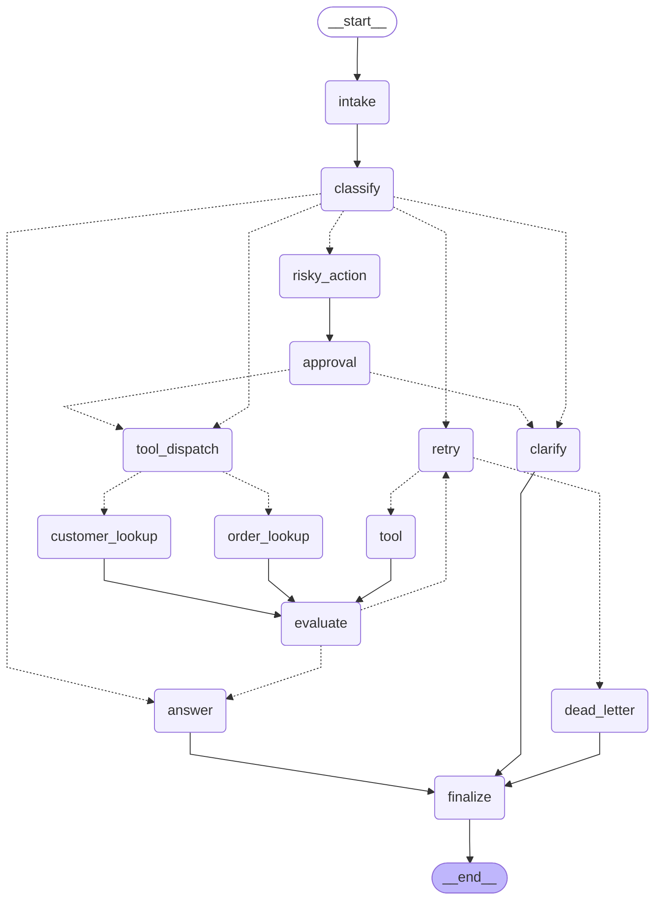

```mermaid
---
config:
  flowchart:
    curve: linear
---
graph TD;
	__start__([<p>__start__</p>]):::first
	intake(intake)
	classify(classify)
	answer(answer)
	clarify(clarify)
	risky_action(risky_action)
	approval(approval)
	evaluate(evaluate)
	retry(retry)
	tool(tool)
	dead_letter(dead_letter)
	finalize(finalize)
	tool_dispatch(tool_dispatch)
	order_lookup(order_lookup)
	customer_lookup(customer_lookup)
	__end__([<p>__end__</p>]):::last
	__start__ --> intake;
	answer --> finalize;
	approval -.-> clarify;
	approval -.-> tool_dispatch;
	clarify --> finalize;
	classify -.-> answer;
	classify -.-> clarify;
	classify -.-> retry;
	classify -.-> risky_action;
	classify -.-> tool_dispatch;
	customer_lookup --> evaluate;
	dead_letter --> finalize;
	evaluate -.-> answer;
	evaluate -.-> retry;
	intake --> classify;
	order_lookup --> evaluate;
	retry -.-> dead_letter;
	retry -.-> tool;
	risky_action --> approval;
	tool --> evaluate;
	tool_dispatch -.-> customer_lookup;
	tool_dispatch -.-> order_lookup;
	finalize --> __end__;
	classDef default fill:#f2f0ff,line-height:1.2
	classDef first fill-opacity:0
	classDef last fill:#bfb6fc

```
