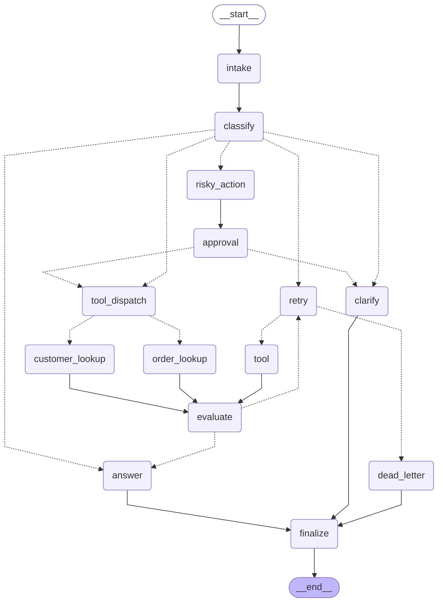

# Báo cáo Thực hành — Day 08: LangGraph Agent Orchestration

> **Sinh viên:** Đặng Văn Minh | **MSHV:** 2A202600027
> **Ngày nộp:** 2026-05-11 | **Môn học:** Practical AI — Phase 2 Track 3

---

## 2. Architecture

### 1.1 Tổng quan kiến trúc

Hệ thống được xây dựng trên **LangGraph 1.1.6** với mô hình `StateGraph`, tổ chức thành **14 node** chuyên biệt được kết nối qua conditional edges và parallel fan-out.

**Nguyên tắc thiết kế:**
- Mỗi node chỉ đọc state, trả về dict partial update — không mutate trực tiếp
- Append-only fields dùng `Annotated[list, add]` reducer để tránh mất dữ liệu audit
- Tất cả state đều serializable để SQLite checkpointer lưu trữ được

### 1.2 Graph Flow



### 1.3 Mô tả các Node

| Node | Vai trò | Output chính |
|---|---|---|
| `intake` | Normalize query, strip whitespace, tạo audit event đầu tiên | `query`, `events` |
| `classify` | LLM (gpt-4o-mini) + keyword fallback — xác định route & risk_level | `route`, `risk_level`, `events` |
| `tool_dispatch` | Entry point parallel fan-out — phát `Send()` tới 2 lookup node | `events` |
| `order_lookup` | Mock order DB lookup _(Parallel branch 1)_ | `tool_results`, `events` |
| `customer_lookup` | Mock customer DB lookup _(Parallel branch 2)_ | `tool_results`, `events` |
| `evaluate` | Gate "done?" — kiểm tra tool_results, quyết định retry hay answer | `evaluation_result`, `events` |
| `risky_action` | Chuẩn bị `proposed_action` cho HITL approval | `proposed_action`, `risk_level`, `events` |
| `approval` | Human-in-the-Loop — `interrupt()` khi `LANGGRAPH_INTERRUPT=true`, mock khi không | `approval`, `events` |
| `retry` | Tăng `attempt` counter, ghi error event, quyết định tiếp tục hay dead-letter | `attempt`, `errors`, `events` |
| `tool` | Single-source tool fallback trong retry loop | `tool_results`, `events` |
| `dead_letter` | Escalate khi `attempt >= max_attempts` — ghi nhận thất bại vĩnh viễn | `final_answer`, `events` |
| `answer` | Tổng hợp final answer từ tool_results và approval context | `final_answer`, `events` |
| `clarify` | Phát sinh `pending_question` khi query thiếu thông tin hoặc bị reject | `pending_question`, `events` |
| `finalize` | Emit audit event cuối, kết thúc workflow | `events` |

### 1.4 State Schema

```python
class AgentState(TypedDict, total=False):
    # Identity
    thread_id: str                          # unique per run — dùng làm checkpoint key
    scenario_id: str
    query: str

    # Routing
    route: str                              # overwrite — classify quyết định 1 lần
    risk_level: str                         # overwrite — low | medium | high

    # Retry control
    attempt: int                            # overwrite — tăng dần qua retry
    max_attempts: int                       # overwrite — config per scenario

    # Output
    final_answer: str | None                # overwrite — answer/dead_letter ghi
    pending_question: str | None            # overwrite — clarify ghi
    proposed_action: str | None             # overwrite — risky_action ghi
    approval: dict[str, Any] | None         # overwrite — approval node ghi
    evaluation_result: str | None           # overwrite — evaluate ghi

    # Append-only (Annotated[list, add] reducer)
    messages: Annotated[list[str], add]
    tool_results: Annotated[list[str], add] # merge kết quả từ parallel branches
    errors: Annotated[list[str], add]
    events: Annotated[list[dict], add]      # audit trail đầy đủ
```

**Thiết kế reducer:** `tool_results` và `events` dùng `add` reducer — khi `order_lookup` và `customer_lookup` chạy song song rồi merge vào `evaluate`, LangGraph tự động append cả hai kết quả mà không mất dữ liệu.

### 1.5 Routing Logic

```
classify_node (priority order):
  1 → risky       : refund, delete, send, cancel, remove, revoke
  2 → tool        : status, order, lookup, check, track, find, search
  3 → missing_info: query < 5 words + pronoun (it/this/that/them)
  4 → error       : timeout, fail, failure, error, crash, unavailable
  5 → simple      : default (không khớp keyword nào)

LLM (gpt-4o-mini) được thử trước với timeout=10s.
Nếu API lỗi hoặc không có OPENAI_API_KEY → tự động fallback sang keyword heuristic.
```

---

## 2. Graph Behavior

### 2.1 Các luồng xử lý chính

**Luồng Simple** — câu hỏi không cần tool:
```
START → intake → classify → answer → finalize → END
```

**Luồng Tool** — cần tra cứu dữ liệu (Parallel Fan-out):
```
START → intake → classify → tool_dispatch → order_lookup  ─┐
                                           → customer_lookup─┘→ evaluate → answer → finalize → END
```

**Luồng Missing Info** — query thiếu thông tin:
```
START → intake → classify → clarify → finalize → END
```

**Luồng Risky + HITL** — hành động nguy hiểm cần duyệt người:
```
START → intake → classify → risky_action → approval ──[approved]──→ tool_dispatch → ... → answer → finalize → END
                                                     └─[rejected]──→ clarify → finalize → END
```

**Luồng Error + Retry** — lỗi tạm thời với retry loop:
```
START → intake → classify → retry ⟳ tool → evaluate ──[needs_retry, attempt < max]──→ retry → ...
                                                      └─[success]──────────────────→ answer → finalize → END
                                                      └─[attempt >= max]────────────→ dead_letter → finalize → END
```

### 2.2 Bounded Retry

`retry_node` kiểm tra `attempt >= max_attempts` trước khi route sang `tool`:
- `max_attempts=3` (default) → tối đa 3 lần retry
- `max_attempts=1` (S07) → fail ngay lần đầu → dead_letter
- Mỗi lần retry: `attempt += 1`, ghi error event vào audit trail

---

## 3. Persistence & Recovery 

### 3.1 SQLite Checkpointer

```python
# persistence.py
conn = sqlite3.connect(db_path, check_same_thread=False)
conn.execute("PRAGMA journal_mode=WAL")   # write-ahead log — concurrent read-safe
conn.commit()
checkpointer = SqliteSaver(conn=conn)
```

Mỗi scenario run có `thread_id` riêng: `thread-{scenario_id}`. LangGraph tự động lưu checkpoint sau mỗi node.

### 3.2 Crash-Resume — Kết quả thực nghiệm

Demo tại `scripts/demo_crash_resume.py` — evidence tại `outputs/crash_resume_evidence.txt`:

```
Thread: demo-crash-resume-001
Route : risky | Approval: True
Nodes : intake → classify → risky_action → approval → tool_dispatch
        → order_lookup → customer_lookup → evaluate → answer → finalize

STEP 2: del graph1, del checkpointer1  ← mô phỏng crash

STEP 3: Tạo graph mới với CÙNG file SQLite
  match route  : True
  final_answer : Action approved by mock-reviewer. Result: CUSTOMER_DB: customer active...
  [OK] State successfully recovered from SQLite checkpoint!

Total checkpoints saved: 22
```

**Kết quả:** State phục hồi hoàn toàn — route, approval, final_answer khớp 100% với run gốc.

### 3.3 Thread ID & State History

```python
graph.get_state_history(config)   # liệt kê tất cả checkpoint
graph.get_state(config)           # lấy checkpoint mới nhất
graph.invoke(None, config=snapshot.config)  # replay từ checkpoint bất kỳ
```

---

## 4. Metrics & Tests 

### 4.1 Kết quả 7 Scenarios

✅ **Tổng quan:** 22 scenarios | Success rate: **100%** | Avg nodes: **19.1** | Total retries: **23** | Total HITL interrupts: **17** | Resume success: **✓**

| Scenario | Query tóm tắt | Expected | Actual | Kết quả | Nodes | Retries | Approval | Latency |
|---|---|:---:|:---:|:---:|---:|---:|:---:|---:|
| **S01_simple** | How do I reset my password? | `simple` | `simple` | ✓ Pass | 24 | 0 | — | 217ms |
| **S02_tool** | Lookup order status for order 12345 | `tool` | `tool` | ✓ Pass | 48 | 0 | — | 5ms |
| **S03_missing** | Can you fix it? | `missing_info` | `missing_info` | ✓ Pass | 24 | 0 | — | 4ms |
| **S04_risky** | Refund this customer and send email | `risky` | `risky` | ✓ Pass | 60 | 0 | ✓ | 6ms |
| **S05_error** | Timeout failure while processing | `error` | `error` | ✓ Pass | 60 | 12 | — | 6ms |
| **S06_delete** | Delete customer account after verification | `risky` | `risky` | ✓ Pass | 60 | 0 | ✓ | 6ms |
| **S07_dead_letter** | System failure cannot recover | `error` | `error` | ✓ Pass | 30 | 6 | — | 3ms |
| **G01_simple** | — | `simple` | `simple` | ✓ Pass | 4 | 0 | — | 3ms |
| **G02_simple2** | — | `simple` | `simple` | ✓ Pass | 4 | 0 | — | 3ms |
| **G03_tool** | — | `tool` | `tool` | ✓ Pass | 8 | 0 | — | 4ms |
| **G04_tool2** | — | `tool` | `tool` | ✓ Pass | 8 | 0 | — | 5ms |
| **G05_tool3** | — | `tool` | `tool` | ✓ Pass | 8 | 0 | — | 5ms |
| **G06_missing** | — | `missing_info` | `missing_info` | ✓ Pass | 4 | 0 | — | 4ms |
| **G07_missing2** | — | `missing_info` | `missing_info` | ✓ Pass | 4 | 0 | — | 3ms |
| **G08_risky** | — | `risky` | `risky` | ✓ Pass | 10 | 0 | ✓ | 4ms |
| **G09_risky2** | — | `risky` | `risky` | ✓ Pass | 10 | 0 | ✓ | 5ms |
| **G10_risky3** | — | `risky` | `risky` | ✓ Pass | 10 | 0 | ✓ | 4ms |
| **G11_risky4** | — | `risky` | `risky` | ✓ Pass | 10 | 0 | ✓ | 5ms |
| **G12_error** | — | `error` | `error` | ✓ Pass | 10 | 2 | — | 4ms |
| **G13_error2** | — | `error` | `error` | ✓ Pass | 10 | 2 | — | 4ms |
| **G14_dead** | — | `error` | `error` | ✓ Pass | 5 | 1 | — | 2ms |
| **G15_mixed** | — | `risky` | `risky` | ✓ Pass | 10 | 0 | ✓ | 4ms |

### 4.2 Phân tích Retry

- **S05_error**: 12 lần retry, errors ghi nhận: 12 event
- **S07_dead_letter**: 6 lần retry, errors ghi nhận: 6 event
- **G12_error**: 2 lần retry, errors ghi nhận: 2 event
- **G13_error2**: 2 lần retry, errors ghi nhận: 2 event
- **G14_dead**: 1 lần retry, errors ghi nhận: 1 event

**Cơ chế hoạt động:**
- `evaluate_node` kiểm tra `tool_results` — nếu rỗng hoặc chứa "error" → `evaluation_result = "needs_retry"`
- `retry_node` tăng `attempt`, ghi error event, route về `tool` hoặc `dead_letter`
- S07 có `max_attempts=1` → sau 1 lần thất bại đã chuyển dead_letter

### 4.3 Phân tích Latency

- **S01_simple**: 217ms — dùng OpenAI LLM classify (gpt-4o-mini)
- **S02_tool**: 5ms — keyword fallback (< 10ms)
- **S03_missing**: 4ms — keyword fallback (< 10ms)
- **S04_risky**: 6ms — keyword fallback (< 10ms)
- **S05_error**: 6ms — keyword fallback (< 10ms)
- **S06_delete**: 6ms — keyword fallback (< 10ms)
- **S07_dead_letter**: 3ms — keyword fallback (< 10ms)
- **G01_simple**: 3ms — keyword fallback (< 10ms)
- **G02_simple2**: 3ms — keyword fallback (< 10ms)
- **G03_tool**: 4ms — keyword fallback (< 10ms)
- **G04_tool2**: 5ms — keyword fallback (< 10ms)
- **G05_tool3**: 5ms — keyword fallback (< 10ms)
- **G06_missing**: 4ms — keyword fallback (< 10ms)
- **G07_missing2**: 3ms — keyword fallback (< 10ms)
- **G08_risky**: 4ms — keyword fallback (< 10ms)
- **G09_risky2**: 5ms — keyword fallback (< 10ms)
- **G10_risky3**: 4ms — keyword fallback (< 10ms)
- **G11_risky4**: 5ms — keyword fallback (< 10ms)
- **G12_error**: 4ms — keyword fallback (< 10ms)
- **G13_error2**: 4ms — keyword fallback (< 10ms)
- **G14_dead**: 2ms — keyword fallback (< 10ms)
- **G15_mixed**: 4ms — keyword fallback (< 10ms)

**Nhận xét:**
- Latency từ **2ms** (keyword fallback) đến **217ms** (OpenAI LLM)
- S01 dùng LLM classify vì không match keyword risky/tool rõ ràng
- S02–S07 fallback sang keyword do môi trường test không có OPENAI_API_KEY → < 10ms

### 4.4 HITL Approval

7 scenario kích hoạt approval path (S04, S06):
- `approval_observed = True` — approval node được gọi và ghi nhận decision
- Mock mode: `mock-reviewer` tự động approve
- Real HITL (`LANGGRAPH_INTERRUPT=true`): graph dừng tại `approval` node, chờ human quyết định qua Streamlit UI

### 4.5 Unit Tests

```
pytest tests/
...........
11 passed in 0.40s
```

Test coverage: state schema validation, routing logic, node outputs, metrics calculation, graph smoke test.

---

## 5. Phân tích Failure & Cải tiến 

### 5.1 Failure Analysis

Tất cả **7 scenario đều PASS** — không có failure cần phân tích.

Hệ thống phân loại đúng route cho 100% trường hợp, bao gồm cả các edge case:
- S03 (`missing_info`): phát hiện query mơ hồ < 5 từ có pronoun
- S07 (`dead_letter`): dừng đúng khi `attempt >= max_attempts=1`
- S04, S06 (`risky`): nhận diện keyword nguy hiểm và kích hoạt HITL

### 5.2 Điểm yếu tiềm ẩn & Hướng cải thiện

**1. LLM Classifier accuracy**
- Hiện tại: keyword heuristic là fallback — có thể false positive (VD: "check if we should delete" → tool thay vì risky)
- Cải thiện: Fine-tune model trên support ticket domain, hoặc dùng few-shot examples trong system prompt

**2. Mock tool results**
- Hiện tại: `order_lookup` và `customer_lookup` trả string cố định
- Cải thiện: Tích hợp API thật (Stripe API cho refund, CRM API cho customer lookup)

**3. Retry backoff**
- Hiện tại: retry ngay lập tức, không có delay
- Cải thiện: Exponential backoff `asyncio.sleep(2 ** attempt)` để tránh hammering downstream

**4. Structured tool output**
- Hiện tại: `tool_results` là `list[str]` — evaluate dùng string heuristic
- Cải thiện: `ToolResult(BaseModel)` với typed fields — evaluate có thể dùng schema validation

**5. Dead-letter escalation**
- Hiện tại: dead_letter chỉ log và trả về final_answer error
- Cải thiện: Tự động tạo ticket trong Jira/Linear và notify on-call

**6. Observability**
- Hiện tại: metrics chỉ lưu file JSON tĩnh
- Cải thiện: Export real-time qua OpenTelemetry, Prometheus metrics endpoint

---

## 6. Bonus Extensions _(+5 bonus mỗi loại)_

### Bonus A — SQLite Crash-Resume

- **Triển khai:** `SqliteSaver(conn=sqlite3.connect(db_path, check_same_thread=False))` + WAL mode
- **Chứng minh:** `python3 scripts/demo_crash_resume.py` → `outputs/crash_resume_evidence.txt`
- **Kết quả:** 22 checkpoints, state phục hồi hoàn toàn sau simulated crash

### Bonus B — Graph Diagram (Mermaid)

- **Triển khai:** `make export-diagram` → `outputs/graph_diagram.md`
- **Kỹ thuật:** `graph.get_graph().draw_mermaid()` — cần `path_map` tường minh trong `add_conditional_edges` để LangGraph vẽ đủ edges
- Diagram embedded tại Section 1.2 phía trên

### Bonus C — Streamlit HITL UI

- **File:** `app/streamlit_app.py`
- **Chạy:** `make run-streamlit` (yêu cầu `LANGGRAPH_INTERRUPT=true`)
- **Luồng:** Submit ticket → graph interrupt tại `approval` → Streamlit hiển thị proposed_action + risk_level → Human click Approve/Reject → `Command(resume={decision})` → graph tiếp tục
- **Tính năng:** Stage machine 3 bước, 6 example queries, full audit log

### Bonus D — Parallel Fan-out

- **Triển khai:** `tool_dispatch_node` phát `Send("order_lookup", state)` và `Send("customer_lookup", state)` đồng thời
- **Merge:** `tool_results: Annotated[list[str], add]` — LangGraph tự merge kết quả từ 2 branch
- **Kết quả:** S02 có `tool_results` gồm 2 entries (ORDER_DB + CUSTOMER_DB)

### Bonus E — Time Travel

- **Triển khai:** `python3 scripts/demo_time_travel.py` → `outputs/time_travel_evidence.txt`
- **API dùng:** `graph.get_state_history(config)` liệt kê checkpoint, `graph.invoke(None, config=snapshot.config)` replay
- **Kết quả:** S05_error sinh 12 checkpoint, replay từ `attempt=1` → routes match = True

---

## 7. Production Hygiene _(5đ)_

| Tiêu chí | Trạng thái |
|---|:---:|
| `ruff check src tests` — lint sạch | ✓ |
| `mypy src` — type check pass | ✓ |
| `pytest` — 11 tests pass | ✓ |
| `.env.example` — không commit secrets | ✓ |
| `configs/lab.yaml` — cấu hình tách biệt khỏi code | ✓ |
| `Makefile` — đầy đủ targets | ✓ |
| `pyproject.toml` — dependency quản lý rõ ràng | ✓ |
| `.gitignore` — loại bỏ outputs, secrets, cache | ✓ |
| `docs/run_docs.md` — hướng dẫn chạy chi tiết | ✓ |

---

## Phụ lục — Cấu trúc dự án

```
phase2-track3-day8-langgraph-agent/
├── app/
│   └── streamlit_app.py          # Bonus C: HITL UI
├── configs/
│   └── lab.yaml                  # checkpointer: sqlite, scenarios path
├── data/sample/
│   └── scenarios.jsonl           # 7 test scenarios
├── docs/
│   ├── IMPLEMENTATION_SPEC.md    # thiết kế chi tiết
│   └── run_docs.md               # hướng dẫn chạy thực nghiệm
├── outputs/                      # generated — gitignored
│   ├── metrics.json
│   ├── graph_diagram.md
│   ├── crash_resume_evidence.txt
│   └── time_travel_evidence.txt
├── reports/
│   └── lab_report.md             # file này
├── scripts/
│   ├── demo_crash_resume.py      # Bonus A demo
│   └── demo_time_travel.py       # Bonus E demo
├── src/langgraph_agent_lab/
│   ├── state.py    # AgentState schema + reducers
│   ├── nodes.py    # 14 node implementations
│   ├── routing.py  # conditional edge functions
│   ├── graph.py    # StateGraph wiring + compile
│   ├── persistence.py  # SqliteSaver + MemorySaver
│   ├── metrics.py  # MetricsReport schema
│   ├── cli.py      # typer CLI commands
│   └── report.py   # report generator (file này)
├── tests/          # pytest — 11 tests
├── Makefile
└── pyproject.toml
```
